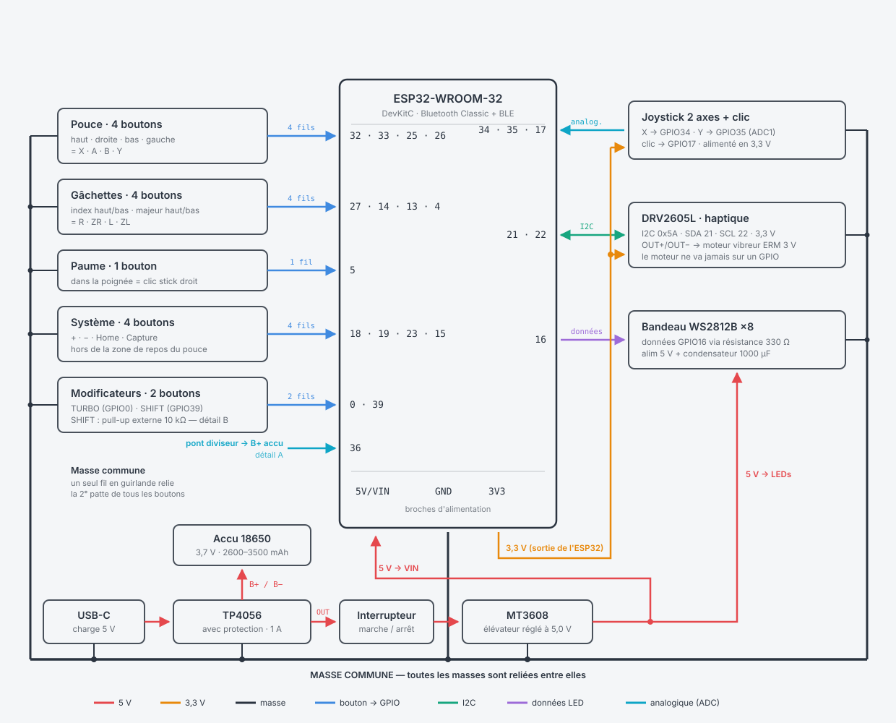
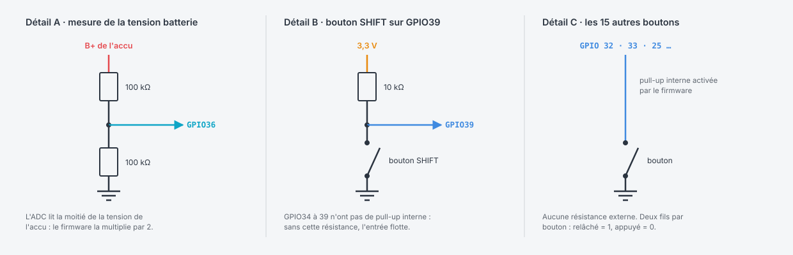

# Câblage



*Vue d'ensemble : les 16 boutons à gauche, les périphériques à droite, l'alimentation
en bas. Les couleurs des traits correspondent aux fonctions des fils.*



*Les trois montages qui demandent de l'attention ; le reste est répétitif.*

Tous les boutons sont câblés entre le GPIO et **GND** (actifs à l'état
bas, pull-up internes sauf mention).

## Brochage ESP32 (doit correspondre à `firmware/src/main.rs`)

| GPIO | Fonction | Remarque |
|------|----------|----------|
| 32 | Bouton pouce · haut | |
| 33 | Bouton pouce · droite | |
| 25 | Bouton pouce · bas | |
| 26 | Bouton pouce · gauche | |
| 27 | Gâchette index · haute (R) | |
| 14 | Gâchette index · basse (ZR) | |
| 13 | Gâchette majeur · haute (L) | |
| 4  | Gâchette majeur · basse (ZL) | maintenue à l'allumage = **mode PC** |
| 5  | Bouton paume | |
| 17 | Clic du joystick | |
| 18 | Bouton + | |
| 19 | Bouton − | |
| 23 | Bouton Home | |
| 15 | Bouton Capture | |
| 0  | Bouton TURBO | c'est aussi BOOT : ne pas le maintenir au reset |
| 39 | Bouton SHIFT | entrée seule : **pull-up externe 10 kΩ vers 3V3** |
| 34 | Joystick axe X | ADC1_CH6, entrée seule |
| 35 | Joystick axe Y | ADC1_CH7, entrée seule |
| 36 | Mesure batterie | pont diviseur 100 kΩ/100 kΩ depuis B+ |
| 21 | I2C SDA → DRV2605L | pull-ups intégrés au module |
| 22 | I2C SCL → DRV2605L | |
| 16 | Données WS2812B | résistance série 330 Ω |

## Alimentation

```
USB-C ──► TP4056 ──► B+/B− ──► Accu 18650
             │
             └─ OUT+/OUT− ──► Interrupteur ──► MT3608 (réglé à 5,0 V)
                                                  │
                     ┌────────────────────────────┤
                     ▼                            ▼
               ESP32 broche 5V/VIN         WS2812B 5V (+ condo 1000 µF)
```

- Le DRV2605L et le joystick se branchent sur le **3V3** de l'ESP32.
- Le moteur vibreur se branche sur OUT+/OUT− du DRV2605L (jamais en
  direct sur un GPIO).
- Régler le MT3608 à 5,0 V **avant** de brancher l'ESP32 (potentiomètre +
  multimètre).
- Le pont diviseur (2 × 100 kΩ) va de **B+** à **GND**, point milieu sur
  GPIO36 : le firmware lit la moitié de la tension batterie.
- Pendant la charge, la manette peut rester allumée (le TP4056 avec
  protection alimente la charge et la sortie).

## Conseils de montage

- Souder les boutons sur des chutes de veroboard collées sur des plaques
  LEGO : les modules restent démontables.
- Un fil de masse commun en « guirlande » entre tous les boutons évite
  la moitié du câblage.
- Vérifier chaque bouton au multimètre avant de fermer la coque, puis
  avec le moniteur série (`cargo run` affiche les appuis en debug).
